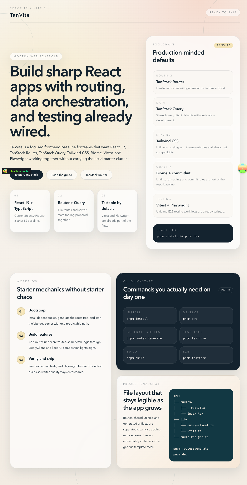

# ⚡ TanVite

[](#-技术栈)
[](#-技术栈)
[](#-技术栈)
[](#-技术栈)
[](#-许可证)
[](https://github.com/YangsonHung/TanVite/actions/workflows/deploy-pages.yml)
[](https://github.com/YangsonHung/TanVite/actions/workflows/ci.yml)
[](https://yangsonhung.github.io/TanVite/)

[English](README.md) | **中文**

TanVite 是一个面向生产环境的 React 19 模板仓库，定位为可复用的高标准前端工程基线，适合严肃的产品研发场景。它将 Vite、TypeScript、TanStack Router、TanStack Query、Tailwind CSS、自动化测试、代码质量约束以及 GitHub Pages 展示能力整合为一套打磨完整、适合新项目直接起步的现代前端最佳实践组合。



## 🛰️ Why TanVite

- 直接从现代 React 19 模板仓库开始，而不是手动拼装工程体系
- 从第一条提交开始统一路由、数据层、样式、测试和 CI 约定
- 将业务部署产物 `dist/` 与 GitHub Pages 展示产物 `dist-pages/` 明确拆分
- 复用已经完成的落地页和 guide 页面作为公开项目展示入口
- 可直接作为 GitHub 模板仓库，用于新项目起步

## 🚀 快速开始

1. 安装依赖。
2. 启动开发服务器。
3. 在浏览器中打开项目。

```bash
pnpm install
pnpm dev
```

打开 `http://localhost:4319`。

## 🧬 使用模板

### 🛸 方式一：使用 GitHub 模板

1. 在 GitHub 打开仓库页面。
2. 点击 `Use this template`。
3. 在你的账号或组织下创建新仓库。
4. 把新仓库克隆到本地。

```bash
git clone <你的新仓库地址>
cd <你的项目目录>
pnpm install
pnpm dev
```

### 🧲 方式二：直接克隆

```bash
git clone https://github.com/YangsonHung/TanVite.git <你的项目目录>
cd <你的项目目录>
pnpm install
pnpm dev
```

### 🧭 下一步

1. 替换首页文案和品牌信息。
2. 在 `src/routes` 下添加或删除页面路由。
3. 把业务逻辑迁移到 `src/lib`、`src/hooks` 和各自的功能目录。
4. 保留现有测试和 CI 作为项目基线。

## 💠 特性

- React 19 + TypeScript + Vite 5 模板仓库基线
- TanStack Router 文件路由
- TanStack Query 数据层
- Tailwind CSS 与 shadcn/ui 兼容工具链
- 使用 Biome 进行 lint 和格式化
- 使用 Vitest + Testing Library 进行单元测试
- 使用 Playwright 进行 E2E 测试
- 使用 Husky + lint-staged + commitlint 约束提交流程

## 🧩 技术栈

| 类别 | 技术 |
| --- | --- |
| 框架 | React 19 |
| 语言 | TypeScript |
| 构建工具 | Vite |
| 包管理器 | pnpm |
| 路由 | TanStack Router |
| 数据获取 | TanStack Query |
| 样式 | Tailwind CSS |
| UI 工具 | shadcn/ui、class-variance-authority、tailwind-merge |
| 代码质量 | Biome |
| 单元测试 | Vitest、Testing Library、jsdom |
| E2E 测试 | Playwright |
| Git Hooks | Husky、lint-staged |

## 🖥️ 环境要求

- Node.js 20+
- pnpm 10+

## 💻 常用脚本

```bash
pnpm routes:generate   # 生成 TanStack Router 路由树
pnpm dev               # 启动 Vite 开发服务器
pnpm build             # 构建应用到 dist/
pnpm build:pages       # 构建 GitHub Pages 站点到 dist-pages/
pnpm preview           # 在 http://localhost:4419 预览 dist/
pnpm preview:pages     # 在 http://localhost:4419 预览 dist-pages/

pnpm test              # 以 watch 模式运行 Vitest
pnpm test:run          # 单次运行单元测试
pnpm test:coverage     # 生成覆盖率报告
pnpm test:e2e          # 运行 Playwright 测试
pnpm test:e2e:ui       # 以 UI 模式运行 Playwright

pnpm check             # 运行 Biome 检查并自动修复
pnpm lint              # 运行 Biome lint
pnpm format            # 运行 Biome format
```

## 🌐 本地预览 GitHub Pages

1. 构建 Pages 产物。
2. 启动 Pages 预览服务。
3. 打开项目站点路径。

```bash
pnpm build:pages
pnpm preview:pages
```

打开 `http://localhost:4419/TanVite/`。

## 🗺️ 项目结构

```text
src/
├── index.css
├── main.tsx
├── routeTree.gen.ts
├── lib/
│   ├── query-client.ts
│   └── utils.ts
├── routes/
│   ├── __root.tsx
│   ├── guide.tsx
│   └── index.tsx
├── types/
│   └── index.ts
└── vite-env.d.ts

tests/
├── e2e/
│   └── home.spec.ts
├── lib/
│   └── utils.test.ts
└── setup.ts
```

## 🛣️ 路由

使用下面的命令生成路由树：

```bash
pnpm routes:generate
```

`pnpm build` 和 `pnpm build:pages` 会在打包前自动生成路由树。

## ☁️ GitHub Pages

使用 GitHub Actions 官方 Pages 部署流。

- 应用构建产物：`dist/`
- Pages 构建产物：`dist-pages/`
- 对外地址：`https://yangsonhung.github.io/TanVite`
- 部署工作流： [.github/workflows/deploy-pages.yml](/Users/yangsonhung/Projects/personal/TanVite/.github/workflows/deploy-pages.yml)

用于 GitHub Pages 时：

- 使用 `pnpm build:pages` 构建
- 生产环境 `base` 使用 `/TanVite/`
- 发布 GitHub Actions artifact，而不是提交 `docs/`
- 在 Pages 产物中保留 `404.html` 和 `.nojekyll` 以支持 SPA 托管

用于常规生产环境部署时，使用 `pnpm build`。

## 🧰 开发默认约定

- React Query Devtools 和 TanStack Router Devtools 仅在开发环境启用
- 在 `src/lib/query-client.ts` 中维护共享 Query 默认配置
- 在 `src/lib/utils.ts` 中使用 `cn()` 工具函数

## 🤝 贡献指南

提交 Pull Request 前请先阅读 [CONTRIBUTING.md](/Users/yangsonhung/Projects/personal/TanVite/CONTRIBUTING.md)。

## 🌀 更新日志

项目变更历史见 [CHANGELOG.md](/Users/yangsonhung/Projects/personal/TanVite/CHANGELOG.md)。

## 🪪 许可证

MIT
